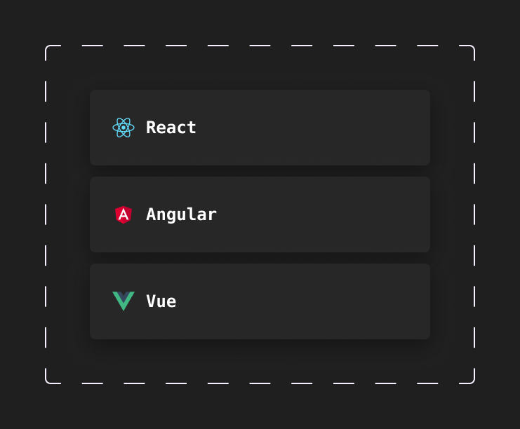
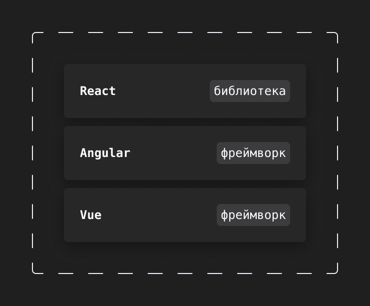
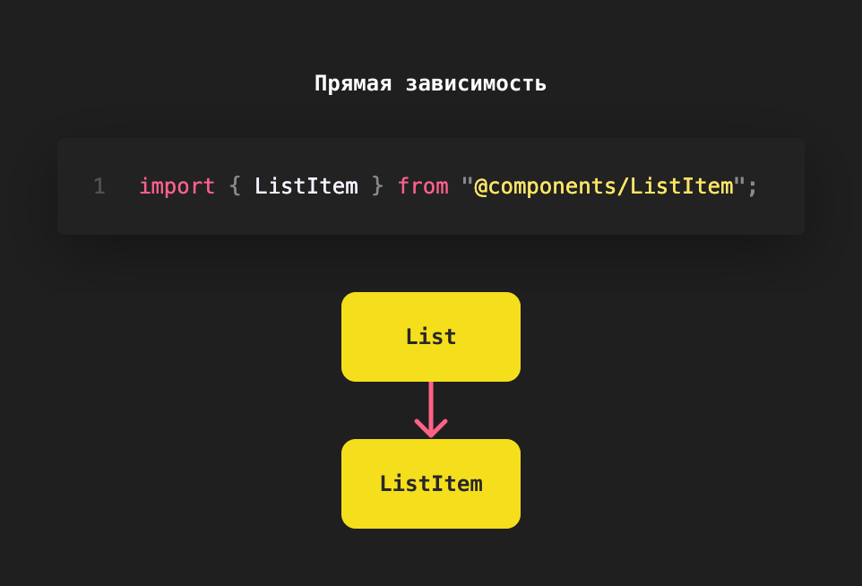
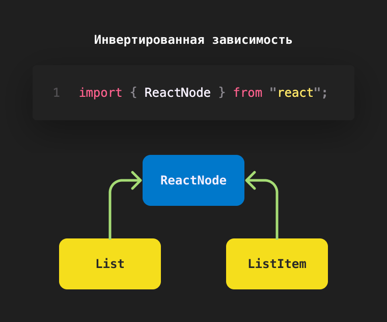
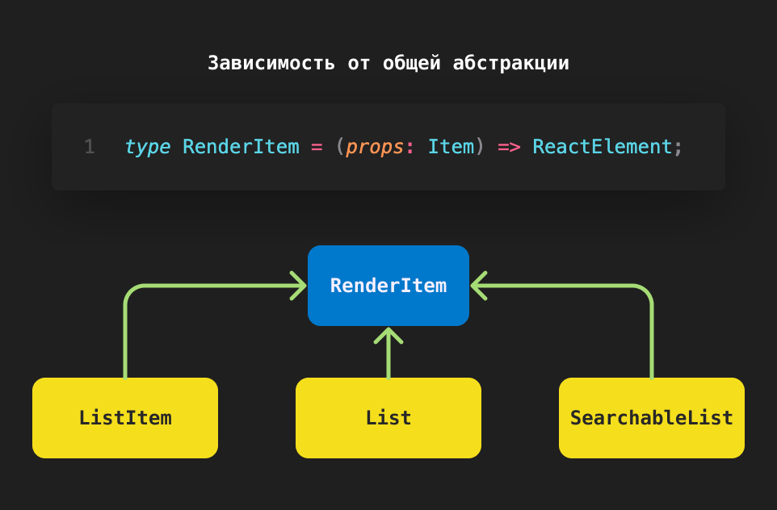
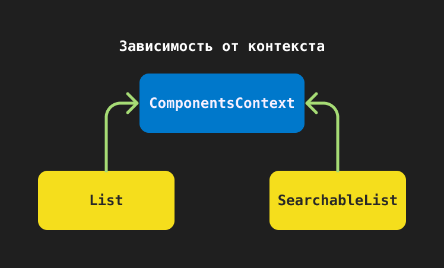

# Инверсия зависимостей в React

Старые добрые принципы [SOLID](https://ru.wikipedia.org/wiki/SOLID_(объектно-ориентированное_программирование)) могут быть полезны в любой области разработки. Особенно важным я считаю принцип [инверсии зависимостей](https://ru.wikipedia.org/wiki/Принцип_инверсии_зависимостей). В React существуют механизмы, позволяющие реализовать этот принцип, и в этом очень помогает Typescript.

## Мотивация

Предположим, что нам досталась задача разработать компонент `List`, отображающий список из нескольких `ListItem`.



```tsx
import { ListItem } from "@components/ListItem";

export interface ListProps {
  items: Item[]; // <- компонент принимает на вход данные элементов списка
}

export const List = ({ items }: ListProps): ReactElement => {
  return (
    <ul className="my-list">
      {items.map(({ id, title }) => (
        <ListItem key={id}>{title}</ListItem>
      ))}
    </ul>
  );
};
```

Некоторое время спустя в другом месте понадобился похожий компонент, но без иконок и с бейджами.



Чтобы не дублировать код, мы реализовали механизм кастомизации `List` с  помощью пропсов, позволяющих включать/выключать определённые параметры элементов списка.

```tsx
import { ListItem } from "@components/ListItem";

export interface ListProps {
  items: Item[];

  // Свойства, передаваемые элементам списка
  hasBadge?: boolean;
  hasIcon?: boolean;
}

export const List = ({ items, hasBadge, hasIcon }: ListProps): ReactElement => {
  return (
    <ul className="my-list">
      {items.map(({ id, title }) => (
        <ListItem key={id} hasBadge={hasBadge} hasIcon={hasIcon}>
          {title}
        </ListItem>
      ))}
    </ul>
  );
};
```

Такая реализация предполагает изменение кода списка и тем самым нарушает [принцип открытости/закрытости](https://ru.wikipedia.org/wiki/Принцип_открытости/закрытости).

API компонента получается недостаточно гибким. Например, если в какой-то момент нам понадобится скрыть иконку у отдельно взятых `ListItem`, мы не сможем этого сделать, поскольку пропса у `List` позволяет сделать это только для всех элементов сразу.


При текущем подходе реализация `List` напрямую зависит от конкретной реализации `ListItem`.



## Инвертируем зависимости

Можно сделать так, что `List` будет принимать не данные для отображения элементов списка, а уже готовые элементы.

```tsx
import { ReactNode } from "react";

export interface ListProps {
  children: ReactNode; // <- компонент принимает элементы вместо их данных
}

export const List = ({ children }: ListProps): ReactElement => {
  return <ul className="my-list">{children}</ul>;
};
```

```tsx
import { List } from "@components/List";
import { ListItem } from "@components/ListItem";

<List>
  <ListItem hasBadge>
    React
  </ListItem>

  <ListItem hasBadge hasIcon>
    Angular
  </ListItem>

  <ListItem hasBadge hasIcon>
    Vue
  </ListItem>
</List>
```

Тем самым мы сделали список зависимым не от конкретной реализации, а от абстракции в виде интерфейса `ReactNode`.



## Расширяем поведение компонента

Следующей задачей стала реализация поиска в этом списке.


Для этого создадим на основе уже имеющихся компонентов новый — `SearchableList`.

```tsx
import { List } from "@components/List";
import { ListItem } from "@components/ListItem";

export interface SearchableListProps {
  items: Item[]; // <- компонент принимает данные элементов, поскольку они нужны для фильтрации
}

export const SearchableList = ({ items }: SearchableListProps): ReactElement => {
  const { items } = props;

  const [searchString, setSearchString] = useState("");

  const handleSearch: ChangeEventHandler<HTMLInputElement> = (event) => {
    setSearchString(event.currentTarget.value);
  };

  const searchedItems = useMemo(
    () => items.filter(({ title }) => title.includes(searchString)),
    [items, searchString]
  );

  return (
    <div>
      <input type="text" value={searchString} onChange={handleSearch} />

      <List>
        {searchedItems.map(({ id, title }) => (
          <ListItem key={id}>{title}</ListItem>
        ))}
      </List>
    </div>
  );
};
```

Компонент `SearchableList` напрямую зависит от компонентов `List` и `ListItem`, поэтому мы снова сталкиваемся с проблемами, которые решали ранее.

Дело в том, что текущая реализация принципа инверсии зависимостей не раскрывает его полностью. `List` принимает на вход уже готовые элементы, хотя мог бы принимать функцию, создающую их (то есть компонент). Для этого мы можем описать интерфейс, которому должны соответствовать компоненты, реализующие элементы списка.

```ts
export type RenderListItem = (props: Item) => ReactElement;
```

В таком случае компонент списка будет принимать на вход данные для списка.

```tsx
import { RenderListItem } from "@interfaces";

export interface ListProps {
  items: Item[];
  children: RenderListItem; // <- функция для рендера элементов вместо самих элементов
}

export const List = ({ items, children: Item }: ListProps): ReactElement => {
  return (
    <ul className="my-list">
      {items.map((item) => (
        <Item key={item.id} {...item} />
      ))}
    </ul>
  );
};
```

Компонент `SearchableList` же расширяет поведение компонента `List`, сохраняя его API.

```tsx
import { ListProps, List } from "@components/List";

export interface SearchableListProps extends ListProps {}

export const SearchableList = ({
  items,
  children,
}: SearchableListProps): ReactElement => {
  const [searchString, setSearchString] = useState("");

  const handleSearch: ChangeEventHandler<HTMLInputElement> = (event) => {
    setSearchString(event.currentTarget.value);
  };

  const searchedItems = useMemo(
    () => items.filter((item) => item.title.includes(searchString)),
    [items, searchString]
  );

  return (
    <div>
      <input type="text" value={searchString} onChange={handleSearch} />

      <List items={searchedItems}>{children}</List>
    </div>
  );
};
```

Этот подход в React называется [render-props](https://ru.reactjs.org/docs/render-props.html).

Теперь при использовании компонента `List` мы можем передать ему любую реализацию элемента списка, соответствующую описанному интерфейсу `RenderListItem`.

```tsx
import { SearchableList } from "@components/SearchableList";
import { ListItem } from "@components/ListItem";
import { RenderListItem } from "@interfaces";

<SearchableList items={items}>{ListItem}</SearchableList>;

const CustomItem: RenderListItem = ({ id, title }) => (
  <li key={id} className="supercool-item">
    {title}
  </li>
);

<SearchableList items={items}>{CustomItem}</List>;
```

Таким образом все наши компоненты не имеют прямых связей между собой, а зависят от одного общего интерфейса.



Помимо гибкости разработки этот подход также упрощает тестирование за счёт того, что мы можем замокать реализацию элементов списка и протестировать сам список изолированно.

## Переопределяем логику

Мы разобрались с тем, как кастомизировать компоненты, но с помощью этого подхода мы можем переопределять что угодно, в том числе и логику. Логика в React реализуется с помощью хуков, которые также можно передавать через props.

Для этого опишем интерфейс, описывающий логику:

```tsx
export type SearchLogic = (
    items: Item[],
    searchString: string
) => Item[];
```

И сделаем компонент зависимым от этого интерфейса.

```tsx
export interface SearchableListProps extends ListProps {
  useSearch: SearchLogic;
}

export const SearchableList = ({
  items,
  useSearch,
  renderItem,
}: SearchableListProps): ReactElement => {
  const [searchString, setSearchString] = useState("");

  const handleSearch: ChangeEventHandler<HTMLInputElement> = (event) => {
    setSearchString(event.currentTarget.value);
  };

  const searchedItems = useSearch(items, searchString);

  return (
    <div>
      <input type="text" value={searchString} onChange={handleSearch} />

      <List items={searchedItems} renderItem={renderItem} />
    </div>
  );
};
```

Теперь компонент `SearchableList` не имеет своей реализации поиска и мы можем определить её при использовании компонента:

```tsx
const CustomItem: RenderListItem = ({ id, title }) => (
  <li key={id} className="supercool-item">
    {title}
  </li>
);

const useSearch: SearchLogic = (items, searchString) =>
    useMemo(
        () =>
            items.filter(
                ({ title, subtitle }) =>
                    title.includes(searchString)
                    || subtitle.includes(searchString)
            ),
        [items, searchString]
    );

<SearchableList
    items={items}
    renderItem={CustomItem}
    useSearch={useSearch}
/>
```

## Внедряем зависимости

Закономерным развитием инверсии зависимостей является [внедрение зависимостей](https://ru.wikipedia.org/wiki/Внедрение_зависимости). Это механизм, позволяющий централизовать передачу зависимостей компонентам.

В React для внедрения зависимостей используется [контекст](https://ru.reactjs.org/docs/context.html). Можно перенести все компоненты, которые мы хотим кастомизировать, в контекст, и в случае необходимости переопределять их из одного места.

Например, создадим контекст для компонента `ListItem`:

```tsx
import { createContext, useContext, memo, ReactNode } from "react";
import { RenderListItem } from "@interfaces";
import { ListItem } from "@components/ListItem";

interface IComponentsContext {
  ListItem: RenderListItem;
}

// Снабдим интерфейс RenderListItem значением по умолчанию,
// которое будет использоваться в случае,
// если мы не переопределили компоненты
const DEFAULT_COMPONENTS: IComponentsContext = {
  ListItem,
};

const ComponentsContext = createContext<IComponentsContext>(DEFAULT_COMPONENTS);
```

Далее создадим хук для получения компонентов из контекста:

```ts
export function useComponents(): IComponentsContext {
  return useContext(ComponentsContext);
}
```

Наконец создадим провайдер, который позволит нам переопределить некоторые компоненты:

```tsx
interface ComponentsProviderProps extends Partial<IComponentsContext> {
  children: ReactNode;
}

export const ComponentsProvider = ({
  children,
  ...overrides
}: ComponentsProviderProps) => {
  // Получаем переопределения из вышестоящего контекста
  const currentComponents = useComponents();

  return (
    <ComponentsContext.Provider value={{ ...currentComponents, ...overrides }}>
      {children}
    </ComponentsContext.Provider>
  );
};
```

Для получения компонентов из контекста просто используем созданный хук:

```tsx
import { useComponents } from "@components/context"

export interface ListProps {
  items: Item[];
}

export const List = ({ items }: ListProps): ReactElement => {
  const { ListItem } = useComponents();

  return (
    <ul className="my-list">
      {items.map((item) => (
        <ListItem key={item.id} {...item} />
      ))}
    </ul>
  );
};
```

В результате мы получаем возможность переопределять дочерние компоненты с помощью провайдера, причём каскадно, как в СSS:

```tsx
const SupercoolItem: RenderItem = ({ id, title }) => (
  <li key={id} className="supercool-item">
    {title}
  </li>
);

const AwesomeItem: RenderItem = ({ id, title }) => (
  <li key={id} className="awesome-item">
    {title}
  </li>
);

<div>
  {/* Этот список будет использовать ListItem по умолчанию */}
  <List items={items} />

  <ComponentsProvider ListItem={SupercoolItem}>
    {/* Этот список будет использовать SupercoolItem */}
    <List items={items} />

    <ComponentsProvider ListItem={AwesomeItem}>
      {/* Этот список будет использовать AwesomeItem */}
      <List items={items} />
    </ComponentsProvider>
  </ComponentsProvider>
</div>
```

Зависимости у нас остаются инвертированными, но теперь компоненты зависят не от интерфейсов, а от контекста.



## Заключение

Принцип инверсии зависимостей достаточно прост и его реализация не потребует больших трудозатрат, но существенно снизит [связанность](https://ru.wikipedia.org/wiki/Зацепление_(программирование)) кодовой базы, что положительно скажется на её гибкости и снизит количество кода, которое понадобится изменить, чтобы внедрить новую функциональность.
